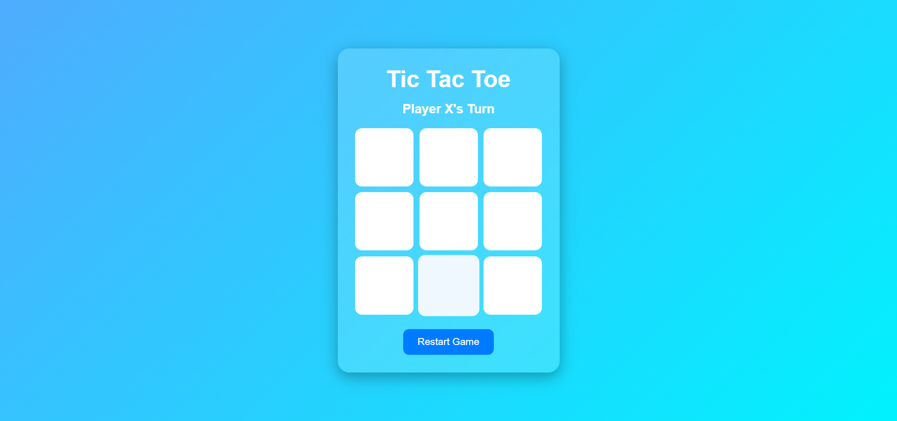
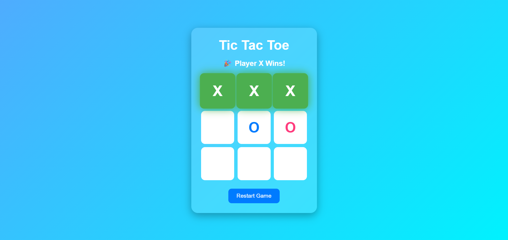

# Tic-Tac-Toe Web Application

## Project Overview
This project was developed as Task 3 of my Web Development Internship at Prodigy InfoTech. It is a browser-based Tic-Tac-Toe game created using HTML, CSS, and JavaScript. The application allows two players to play interactively with automatic win and draw detection.

## Features
- Two-player gameplay
- Automatic win detection
- Draw detection
- Reset game option
- Responsive and user-friendly interface

## Technologies Used
- HTML5
- CSS3
- JavaScript

## Project Structure
```
PRODIGY_WD_03/
│── index.html
│── style.css
│── script.js
│── README.md
└── screenshots/
```

## How to Run
1. Download or clone this repository.
2. Open the project folder.
3. Open `index.html` in any modern web browser.

## Learning Outcomes
- Learned how to implement game logic using JavaScript.
- Improved my understanding of DOM manipulation and event handling.
- Gained experience in managing game states and validating user interactions.
- Enhanced my skills in creating responsive and interactive web applications.
- Strengthened my debugging and problem-solving abilities while developing game functionality.

  ## Screenshots

### Game Start


### Winning State


## Author
**Pranjali Sonone**
